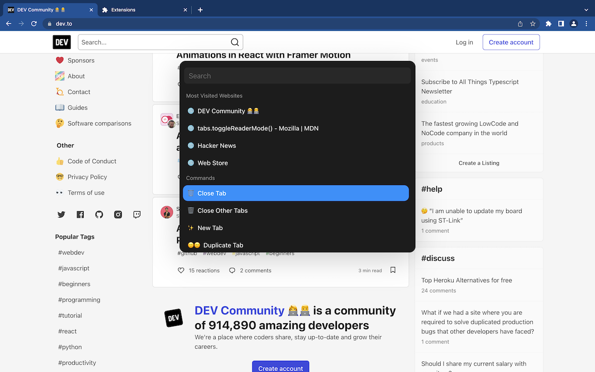

# Quick search

Chrome extension to do things quickly.


## How to install?

Visit Chrome web store [here](https://chrome.google.com/webstore/detail/quick-search/goejincbenkgogiffgbolgpeeodilbmh/related?hl=en&authuser=0) to install the extension
Press "CMD+E" or "CTRL+E" to launch the quick search menu.

## To run

```
$ pnpm
$ pnpm start

```

## Why?

This Chrome extension shows you command palette to do things easily in Chrome.
This is a fun expirement to see how far I can push Chrome extension manifest v3

## How does it look?



## Limitations

- This extension won't run inside chrome native tabs like chrome://extensions, chrome://history
- There are some functionalities that can't be build because of the way Chrome extension work
